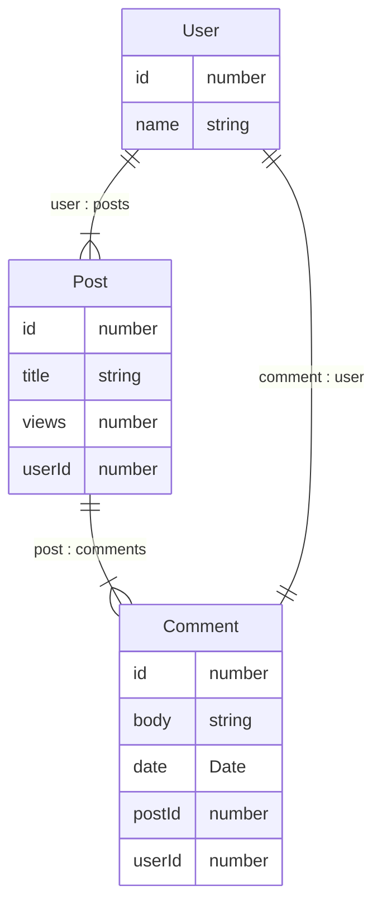

# はじめに
マイクロサービスの知見を得るため、[ApolloのFederation](https://www.apollographql.com/apollo-federation/)を実装してみました。

マイクロサービス、フェデレーションの概念・仕組みはドキュメントやその他参考記事に譲り、ひと通り実装してみての良かったところや懸念点などを重視しています。
もし定義や言葉の間違い等がありましたらご指摘いただけると大変ありがたいです。
---

---
# Apollo GraphQLとは

流行りのChatGPTに聞いてみます。


Apollo GraphQL はGraphQLのフレームワークです。

サーバーサイド・クライアントの両方用意されています。

---

# Apollo Federationとは

GraphQLで実装されたサーバーサイドの集まりです。

公式ドキュメントがわかりやすいので詳しくは[公式ドキュメント](https://www.apollographql.com/docs/federation/)を参照ください。

https://www.apollographql.com/docs/federation/

---

ここでは下記参考図をもとに説明します。

|
|:-:|

この図でいうと、subgraph、Routerのそれぞれが、サーバーサイドのインスタンスで、RouterはGatewayとも呼ばれています。

- Router × 1
- subgraph  × 3

で合計4台サーバーが立っている状態です。

クライアントはRouter(Gateway)とつながっていて、リクエストはRouter(Gateway)がうけて、各subgraphのリレーションを解決してレスポンスを返します。
subgraphという単位で独自にDBやインスタンスがわかれていて、
それぞれがGraphQLで実装されていればRouter(Gateway)がとりまとめてくれるので、それぞれのsubgraphがどんな言語で実装されているかを問わず一定のレスポンスを返すことができるそうです。
今回はすべてのsubgraphをNestJSで実装しています。

---

# 例
はじめに例として、リクエスト・レスポンス・データ例をそれぞれ見せたほうがわかりやすいと思うので、今回実装した例を出しておきます。
Twitterみたいな、`User`・`Post`・`Comment`を想定してみました。

---

## データ構造

### ER図



---

### データ

```ts:data
const users = [
  { id: 1, name: 'John Doe' },
  { id: 2, name: 'Jane Doe' },
];

const posts = [
  { id: 1, title: 'Lorem Ipsum', views: 254, userId: 1 },
  { id: 2, title: 'Sic Dolor amet', views: 65, userId: 2 },
];

const comments = [
  { id: 1, body: '111', postId: 1, userId: 1, date: new Date() },
  { id: 2, body: '112', postId: 2, userId: 2, date: new Date() },
  { id: 3, body: '122', postId: 2, userId: 2, date: new Date() },
];
```
---

### リクエスト

```http:URL
  POST http://localhost:3000/graphql (gateway)
```

```graphql:BODY
// すべてのフィールド（プロパティ）は含めていません

query Posts {
  posts {
    id
    title
    userId
    comments {
      id
      postId
      body
      date
      userId
      user {
        id
        name
        posts {
          id
          title
        }
      } 
    }
  }
}
```

---

### レスポンス

```json:RESPONSE
{
  "data": {
    "posts": [
      {
        "id": 1,
        "title": "Lorem Ipsum",
        "userId": 1,
        "comments": [
          {
            "id": 1,
            "postId": 1,
            "body": "111",
            "date": "2022-12-08T13:43:09.313Z",
            "userId": 1,
            "user": {
              "id": 1,
              "name": "John Doe",
              "posts": [
                {
                  "id": 1,
                  "title": "Lorem Ipsum"
                }
              ]
            }
          }
        ]
      },
      {
        "id": 2,
        "title": "Sic Dolor amet",
        "userId": 2,
        "comments": [
          {
            "id": 2,
            "postId": 2,
            "body": "112",
            "date": "2022-12-08T13:43:09.313Z",
            "userId": 2,
            "user": {
              "id": 2,
              "name": "Jane Doe",
              "posts": [
                {
                  "id": 2,
                  "title": "Sic Dolor amet"
                }
              ]
            }
          },
          {
            "id": 3,
            "postId": 2,
            "body": "122",
            "date": "2022-12-08T13:43:09.313Z",
            "userId": 2,
            "user": {
              "id": 2,
              "name": "Jane Doe",
              "posts": [
                {
                  "id": 2,
                  "title": "Sic Dolor amet"
                }
              ]
            }
          }
        ]
      }
    ]
  }
}
```


---

# 実装例

Nestjsの公式ドキュメントに沿って実装しています。
下記がドキュメントとコードになります。

https://docs.nestjs.com/graphql/federation

---

GraphQLってコードファースト、スキーマファーストで実装方法が分かれるのですが、どちらにもメリットデメリットありますが、自分はコードファーストで実装しています。
既存プロジェクトだと、スキーマファーストが導入しやすいのではないでしょうか。

---

下記が、Router(Gateway)と各subgraphです。

- Router(Gateway): https://github.com/yuyakinjo/gql-gateway
- User: https://github.com/yuyakinjo/gql-user-server
- Post: https://github.com/yuyakinjo/gql-post-server
- Comment: https://github.com/yuyakinjo/gql-comment-server

---

ちなみに、Router(Gateway)の実装でやることは、各subgraphのURLの追記とゲートウェイ用のパッケージのだけです。
https://github.com/yuyakinjo/gql-gateway/blob/a1aab9be8333b42e0b7ac6323af6ee5ec286aa44/src/app.module.ts#L14

---

Router(Gateway)にスキーマ定義不要で、各subgraphのスキーマ見て、自動で補完してくれます。

各subgraph の mutation(データの更新・削除)も Router(Gateway) が取り持ってくれます。

下記GIFは、Router(Gateway)にアクセスしてクエリを書いているところです。

|
|:-:|

---

# 実装してみての感想

## 目からウロコな体験

### 1. DBのリレーションをひかなくてもいい

今回の例は、DB使っていないのですが、エンティティファイルとリゾルバー上でデータの関連付けし、レスポンスも返ってきました。
DBを使ったとしても、SQLでいうwhere句だけです。
DBのリレーションをひかずとも、リゾルバーのみでデータ紐付けるの楽すぎます。。
subgraphの構成が 1サーバー、1DB、1テーブルのみでsubgraphを構成するとした場合、他subgraphの参照だけ気にすればいいので疎結合な実装を保てそうです。
あと、いちいちマイグレーションコマンドうつの面倒ってことに気付かされました。
リレーションにとらわれない実装がここにはあったという目からウロコ感

※ TypeORMではマイグレーション[自動実行モード(synchronize)](https://typeorm.io/data-source-options#common-data-source-options)があります

---

### 2. Router(Gateway)用意に手間が必要ない
Router(Gateway)は、Gateway用のパッケージ追加と、各subgraphのURLを記述するだけです。
それなのに、さきほどGIFで見たとおり、クエリを書く時のフィールド（プロパティ）は自動補完されます。
なので、Graphqlで実装されていれば、フェデレーションの中に加えてすぐ連携ができます。

---

## 懸念点

以下、個人開発でマイクロサービスを選択したときの懸念です（書いたあとに思った）

### 1. 個人開発では重い
マイクロサービスを選択するということは、各subgraphを切り離せる = 各subgraphでスケールさせられるのが狙いだと思います。
ただ、個人開発でサーバー数が多くなるので、デプロイするとなると金額も高くなります。
また、 AWS ECSで 1subgraph、1ECSサービスの構成でやるとなると、リポジトリごとにdockerfile用意しないといけないので、やはり個人開発にこの手法はおおげさかもです。

---

### 2. 共通処理どうしよう
これも個人開発の懸念点です。たとえば、NestJSで`UPDATE`メソッドから`UPSERT`メソッドに切り替えたいなぁとか、いいエラーハンドリングの方法見つけて、すべてそれにしたいなぁとか、各subgraph単位でやるの面倒すぎです。
向いているのは多言語、多チーム、多人数、他連携、いわゆるダイバーシティな開発で有効なのですね。

---

### 3. package管理
サーバー数 × packageのアップデート管理面倒ですね（みんなでやろう or 自動化頑張ろう）

---

### 4. ローカル開発でサーバー立ち上げるの大変
サーバーひとつだけ立ち上げて、レスポンス確認だけもできるのですが、全体を立ち上げるときは、`npm run start × サーバー数` or `docker-compose.yml`にまとめておかないと大変です。
リポジトリがたくさんある場合、Githubから大量のcloneコマンドを叩かないといけないですね。サーバーによっては環境ファイルもあるでしょう。

---

# 実装する勘所

## 新規プロジェクト

1. 一旦GraphQLで実装
1. いよいよ複数人数、多言語、他連携なサービスになってきた(subgraph3台以上相当)
1. Gateway用意じゃー

---

## 既存プロジェクト

1. Gateway用意
1. クライアント目線で、DB1テーブルずつ、subgraph化し、同時並行で切り分けていく
1. モノリシックなサーバーサイドをすべて分割。残るのはサーバーサイドに実装されたバッチ処理とかになってくるはず（残滓）
1. 残滓だけGatewayから切り離したECS・Lambdaで実装

※ あくまで自分の脳内だけでの設計です

---

# 参考

- [Apollo 公式ドキュメント](https://www.apollographql.com/docs/)
- [Apollo Federation](https://www.apollographql.com/docs/federation/)
- [NestJS - federation 公式ドキュメント](https://docs.nestjs.com/graphql/federation)
- [Apollo提供のフェデレーションのチュートリアル](https://www.apollographql.com/tutorials/)
